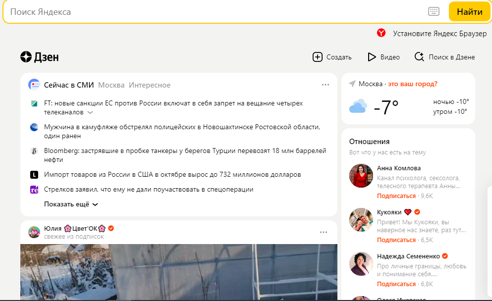
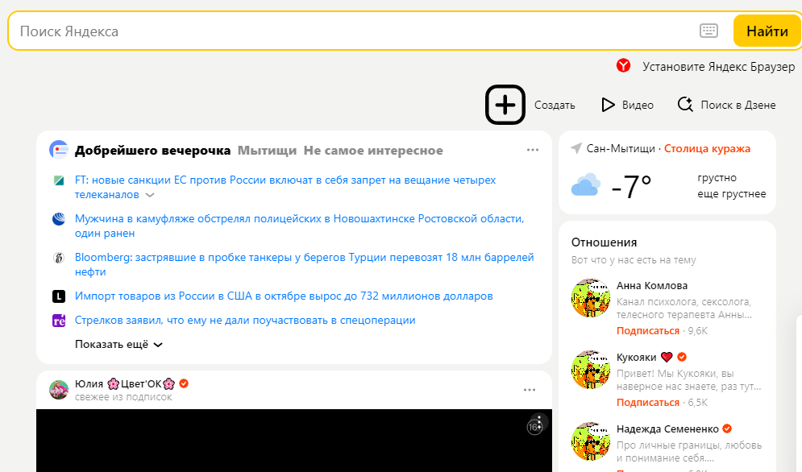

**1. Определите, на каком протоколе работает сайт dzen.ru.**

dzen.ru работает на протоколе - HTTPS

**2. Внесите не менее 5 изменений на страницу с помощью инструмента разработчика и представьте скриншоты было/стало (сайт dzen.ru)** 

Было:

Стало:
